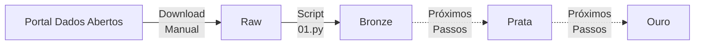

# Análise: Eleições 2024

Análise sobre candidatos às eleições municipais de 2024, com foco nos candidatos do estado da Paraíba.

Análise inspirado nos repostiórios [TeoMeWhy TSE Analytics](https://github.com/TeoMeWhy/tse-analytics) e [TeoMeWhy TSE Analytics - 2024](https://github.com/TeoMeWhy/tse-analytics-2024), ambos desenvolvidos por [Téo Calvo, @TeoMeWhy](https://github.com/TeoMeWhy).

O arquivo de configuração `pyproject.toml` foi baseado no apresentado no curso [FastAPI do Zero](https://fastapidozero.dunossauro.com/), do [@dunossauro](https://github.com/dunossauro).

## Estado do Repositório

O repositório foi iniciado e encontra-se no primeiro estado de desenvolvimento, com a extração dos dados e primeira etapa de processamento deles.

Foi realizado o download dos dados de candidatos no Portal Dados Abertos do Governo Federal. Os arquivos originais em formato ZIP foram armazenados na camada `raw`, na pasta `data`.

Em seguida, o script `01.py` realizou a extração dos arquivos CSV para a camada `bronze`.

A escolha das camadas raw e bronze, e em seguida ouro e prata, ocorreram com base nas práticas de engenharia de dados que buscar separar os dados de um data lake de acordo com seu estado de "maturidade".

### Próximas Etapas

- [ ] Implementar download dos arquivos no script inicial, substituindo o download manual
